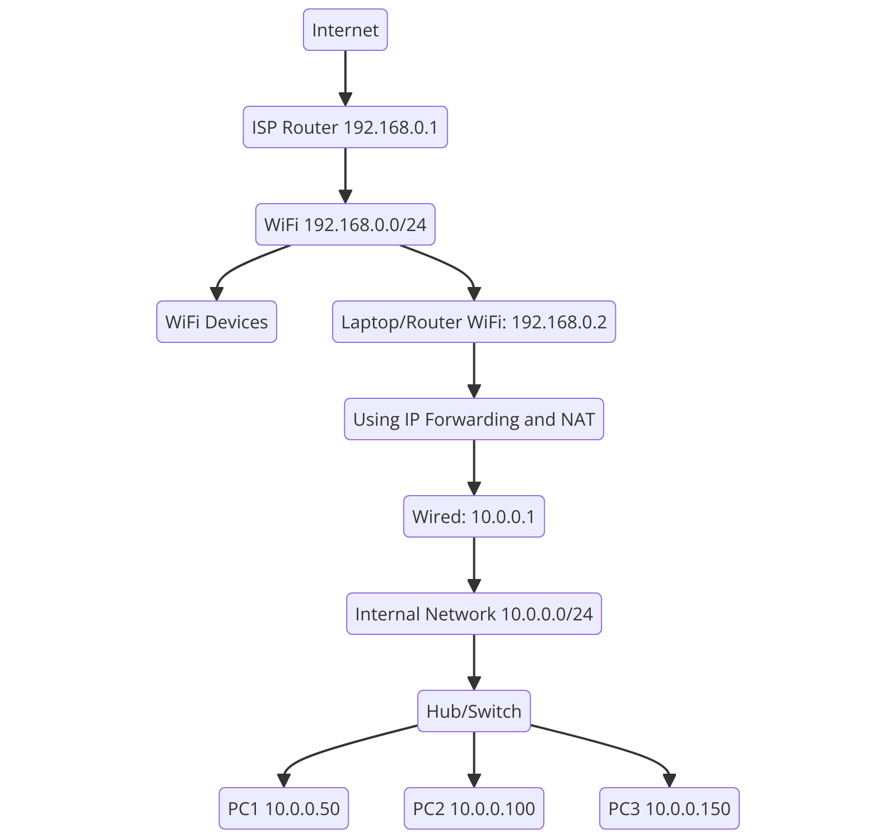

# Laptop DHCP and PXE Server

This project provides Docker Compose files and setup instructions to configure a laptop as a DHCP and PXE server. Laptops are ideal for this setup due to their built-in Wi-Fi and wired network devices, allowing for flexible network configurations. This setup enables client devices within the network to automatically receive IP addresses and boot over the network using PXE.

## Prerequisites

- **Docker:** Docker and Docker Compose need to be installed.
- **Laptop:** A laptop with both Wi-Fi and wired network devices.
- **Netplan:** The network configuration tool used in recent versions of Ubuntu. Instead of using `/etc/network/interfaces`, you will edit the configuration files located in the `/etc/netplan/` directory.
- **Customizing Network Interfaces:** Adjust the network interface names such as `enp1s0` and `wlp2s0` to match your environment.

## Basic Network Configuration

1. **Utilizing the Laptop's Network Devices**:
   - Laptops typically come equipped with both Wi-Fi and wired network devices. This project takes advantage of these devices to build the network.

2. **Network Configuration in Ubuntu (Using Netplan)**:
   - In recent versions of Ubuntu, the `/etc/network/interfaces` file is no longer used. Instead, network settings are managed using Netplan, with configuration files located in the `/etc/netplan/` directory. Adjust the network interface names (e.g., `enp1s0`, `wlp2s0`) according to your environment.

3. **Netplan Configuration Example for the Server PC**:
   - Below is an example of a Netplan configuration where a static IP address is set, allowing other client PCs to use the server PC as their gateway.

   ```yaml
   network:
    version: 2
    ethernets:
        enp1s0:
            addresses:
                - 10.0.0.1/24
            nameservers:
                addresses:
                    - 8.8.8.8
                    - 8.8.4.4
    wifis:
        wlp2s0:
            access-points:
                "TP-Link_6BEB":
                    password: "123456789"
            dhcp4: true
   ```
4. **Example configuration for a client PC:**
   -This section shows an example configuration for a client PC using the server PC as a gateway. This section includes how to configure the static IP address version, the DHCP version, and the Windows client.

**Fixed IP Address Version (Ubuntu):**
- Use the following Netplan configuration to set up a static IP address on an Ubuntu client PC

   ```yaml
   network:
  version: 2
  ethernets:
    enp1s0:
      addresses:
        - 10.0.0.100/24
      gateway4: 10.0.0.1
      nameservers:
        addresses:
          - 8.8.8.8
          - 8.8.4.4
    ```

**DHCP version (Ubuntu):**
- This is an example of a Netplan configuration where the client PC automatically obtains an IP address from the server PC using DHCP.

  ```yaml
  network:
  version: 2
  ethernets:
    enp1s0:
      dhcp4: true
  ```

**Check Windows client PC network settings:**

The following is a procedure to check the network adapter settings of a Windows client PC and set it to obtain an IP address automatically via DHCP. 1.

Click “Network and Sharing Center” and then click “Change Adapter Settings”. 2.
Right click on the network adapter you are using and select “Properties”. 3.
Select “Internet Protocol Version 4 (TCP/IPv4)” and click “Properties”. 4.
Normally, this will be left as is and the IP address will be obtained automatically from the DHCP server.

5. **Configure the Docker container:**

- Using the following two GitHub pages as reference, set up a NetBoot.XYZ container and a DHCP server container using Docker The NetBoot.XYZ container will function as a TFTP server, but the DHCP server must be configured separately.

  - [NetBoot.XYZ container](https://github.com/netbootxyz/docker-netbootxyz)
  - [DHCP server container](https://github.com/wastrachan/docker-dhcpd)

- A combined version of these is available as `docker-compose.yml`, so please use that.

6. **What to do before running docker-compose up -d**

**Create a fixed network**.

First, create a fixed custom network in Docker. This will ensure a fixed IP range for the network. The reason for creating it was mentioned earlier, but will be explained again. If the `docker0` network changes every time you reboot, you will have to update the `dhcpd.conf` file every time, which is inefficient.

Run the following command to create a fixed custom network

```bash
docker network create --subnet=172.20.0.0/16 my_custom_network
```
This will create a fixed network named `my_custom_network` with subnet `172.20.0.0/16`.

**docker0 network**.

`docker0` is the default bridge network automatically created by Docker.

When you launch a Docker container, this network will be used unless you specify otherwise, so it is recommended that you create and use a custom network.

7. **Configure IP forwarding and NAT:**

**Configuration Methods:**

a. **Enable IP forwarding**

   - **Temporarily enable:**
     ```bash
     sudo sysctl -w net.ipv4.ip_forward=1
     ```

   - **Permanently enable:**
     Add the following line to the `/etc/sysctl.conf` file.
     ```bash
     net.ipv4.ip_forward=1
     ```
     With this setting, the server PC will be ready to forward traffic for other devices in the network.

b. **NAT configuration (using iptables)**

   - **NAT (Network Address Translation)** is a technology that allows devices in a private network to access the Internet. NAT allows a private IP address to communicate with the Internet by translating it into a public IP address.
   - NAT can also translate a private address to another private address, which is sometimes called “NAT within the local network” or “internal NAT. Internet connection.

   - **How to configure NAT:**
     - Command to configure NAT:
       ```bash
       sudo iptables -t nat -A POSTROUTING -o wlp2s0 -j MASQUERADE
       ```
     - Configuring NAT for a specific subnet:
       ```bash
       sudo iptables -t nat -A POSTROUTING -s 10.0.0.0/24 -o wlp2s0 -j MASQUERADE
       ```

   - **Configuration persistence:**
     The iptables configuration is reset after a reboot, so you need to make the configuration persistent.

     - **Install packages:**
       ```bash
       sudo apt-get install iptables-persistent
       ````

     - **Save the configuration:**
       ```bash
       sudo netfilter-persistent save
       ```
### Setup Instructions

1. **Clone the repository.**

   ```bash
   git clone https://github.com/superdoccimo/notepc.git
   ```
2. **Navigate to the directory.**
   ```bash
   cd notepc
   ```
3. **Use Docker Compose to start the containers.**
   ```bash
   docker-compose up -d
   ```

### PXE Boot Procedure

- **UEFI First vs Legacy First:**

  - **UEFI First:** Prioritizes booting from UEFI-compatible media and is recommended when compatibility is available. This is effective when installing new systems or operating systems.

  - **Legacy First:** Used for older hardware or when only legacy boot is supported. This is convenient when compatibility is required.

  The `docker-compose.yml` file supports both environments.

- **Login to the Management Interface:**

  - Access the following URL in your browser:  
    `http://your-server-ip-address:3000/`

  - In this management interface, you can update files. Be sure to do this to obtain the latest distribution versions. Failing to update may result in installation failures.

  - Files like `netboot.xyz-arm64-snp.efi` may have been updated. This file is a network boot image specifically for ARM64 architecture in UEFI environments. Other files can also be checked at the following URL:  
    [netboot.xyz Releases](https://github.com/netbootxyz/netboot.xyz/releases)

- **File Details:**

  - **netboot.xyz-arm64-snp.efi:**  
    This is a network boot image used in UEFI (Unified Extensible Firmware Interface) environments for ARM64 architecture. `snp` stands for Simple Network Protocol, which is used during network boot. `netboot.xyz` utilizes this image to enable network booting of various Linux distributions and utilities.

  - **Benefits of Updating This File Include:**
    - **New Boot Options and Features:** For example, new options such as ZFSBootMenu and VanillaOS may be added.
    - **Bug Fixes and Performance Improvements for Existing Options:** For example, issues with installing Ubuntu 24.04 may have been resolved.

  - Updating this file ensures that new features and fixes are applied during network boot, resulting in a smoother boot process.

### Supplementary Information and Reference Links

- **Supplementary Pages:**
  - [Link 1](https://betelgeuse.work/archives/7481) - Contains supplementary explanations and detailed information.
  - [Link 2](https://betelgeuse.work/archives/7832) - Includes additional documentation related to this project.

- **Reference Videos:**
  - [Video 1](https://youtu.be/lpLYnw0Sj34) - A video guide on setting up and using the project.
  - [Video 2](https://youtu.be/qw6fyu_2TTk) - A tutorial video explaining the PXE boot procedure.

### Network Diagram

Below is an image illustrating the network configuration. It helps visually understand the network segmentation and the roles of each device.



